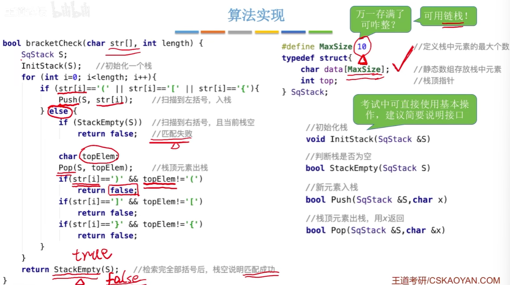
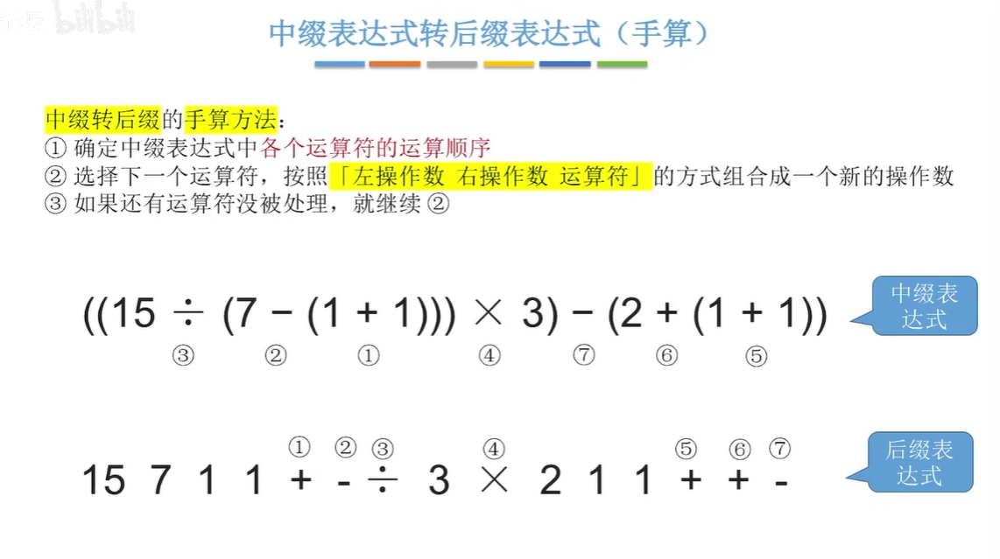
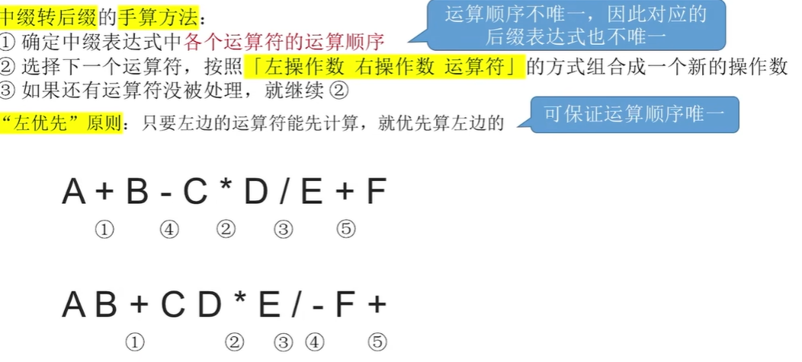

<h1 align="center">卡尔-王道数据结构与算法</h1>
<a href="https://github.com/ToDreamr/Cpp-Algorithm">
  

     
  
 
</a>

This is a simple implement of Data Structure used with cpp.

You need to compile the code with Cmake/MinGW.

If you are preparing for the entrance examination of Postgraduate Examinations for a Graduate degree in computing.
This project may of a little help for U,but you can find some useful test in this repo.If you have a better idea ,
just modify and correct the code by forking this repo,I will handle your pull request.

The following are some content of this repo:

### 序列输出的合法性：

$$
排列顺序： A_{n}^{n}
\\
n个元素的合法出栈数：
{1 \over n+1}C_{2n}^{n}
$$

在双端队列的情况下，栈不可能的情况就有可能发生了，但不可能所有情况都合法。

### 栈括号匹配

$$
中缀表达式 : a+b-c   a+b-c*d

逆波兰表达式 : ab + c - 或 a bc- +     ab+ cd * -

波兰表达式 : - + ab c     + ab *-cd
$$

左优先原则：只要左边的运算能先计算就先计算左边的

