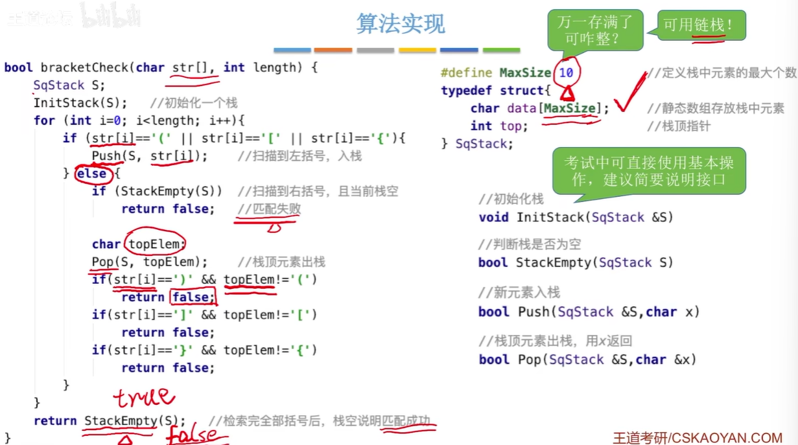
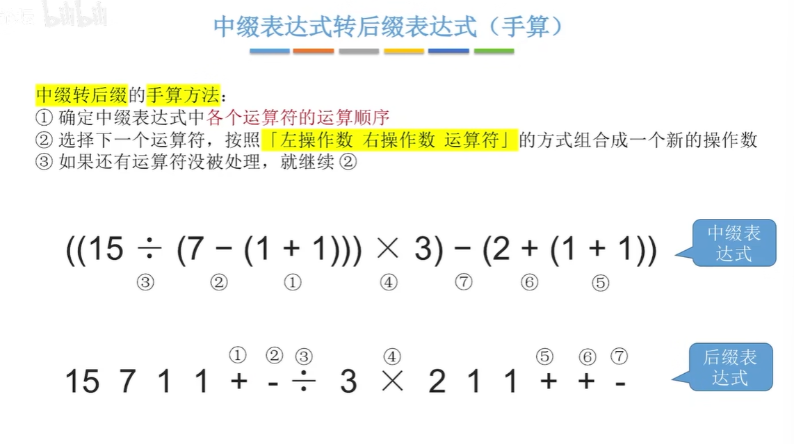
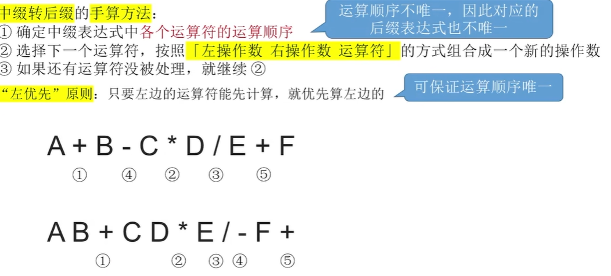

### 序列输出的合法性：

$$
排列顺序： A_{n}^{n}
\\
n个元素的合法出栈数：
{1 \over n+1}C_{2n}^{n}
$$

在双端队列的情况下，栈不可能的情况就有可能发生了，但不可能所有情况都合法。

### 栈括号匹配

$$
中缀表达式 : a+b-c   a+b-c*d
\\
逆波兰表达式 : ab + c - 或 a bc- +     ab+ cd * -
\\
波兰表达式 : - + ab c     + ab *-cd
$$

左优先原则：只要左边的运算能先计算就先计算左边的

